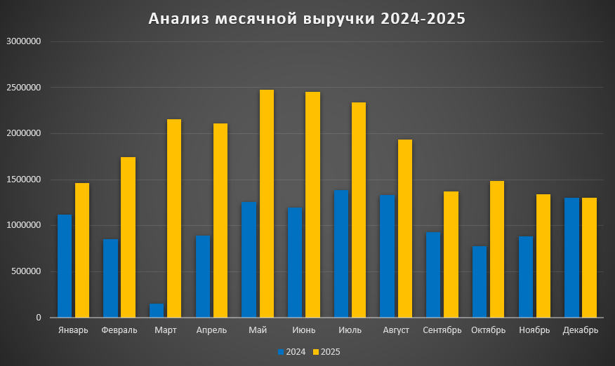
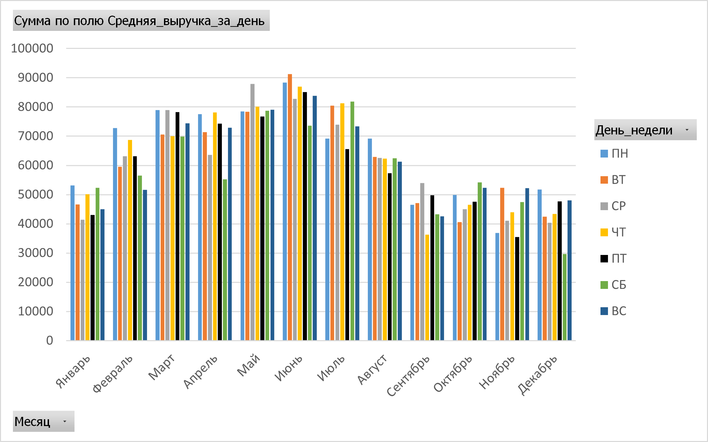

# sales_debt-analysis
# Анализ продаж продуктового магазина (2024–2025)

## 📌 Описание проекта
Проект выполнен на основе данных кассовой системы **Frontol** (файл `report.txt`, 300 МБ) за 2024–2025 годы. Цель — очистить данные от аномалий, выявить сезонность по месяцам, определить самые прибыльные дни недели и сравнить динамику двух лет.

---

## ⚙️ Обработка данных

1. **Фильтрация** – из логов выделены только продажи (код транзакции `11`).
2. **Очистка** – исключены чеки на сумму ≥ 10 000 ₽, чтобы убрать случайные искажения от редких крупных покупок.
3. **Агрегация** – для каждого дня рассчитана общая выручка.
4. **Расчёт средней по дням недели** – для каждого месяца и дня недели вычислена средняя выручка за один день (с учётом разного количества дней в месяце).
5. **Визуализация** – построены диаграммы для сравнения по месяцам и дням недели.

---

## 📊 Результаты визуализации

### 1. Сравнение месячной выручки (2024–2025)

*На диаграмме представлена динамика месячной выручки за два года (без учёта крупных чеков).*

- Наблюдается устойчивая сезонность: в определённые периоды года выручка стабильно выше, в другие – ниже.
- В большинстве месяцев 2025 года выручка превышает показатели 2024, что говорит о положительной динамике бизнеса.

---

### 2. Анализ выручки по дням недели (2024)

*Гистограмма показывает среднюю выручку за один день недели для каждого месяца 2024 года.*

- В тёплые месяцы пик выручки приходится на выходные дни (суббота, воскресенье).
- В холодные месяцы пик может смещаться на пятницу.

---

### 3. Анализ выручки по дням недели (2025)

*Гистограмма показывает среднюю выручку за один день недели для каждого месяца 2025 года.*

- Паттерн повторяется: выходные дни остаются самыми прибыльными в большинстве месяцев.
- Разница между самыми прибыльными и самыми слабыми днями недели варьируется в зависимости от месяца.

---

## 📈 Выводы

- **Сезонность:** выделяются периоды роста и спада выручки, повторяющиеся из года в год.
- **Дни недели:** выходные дни (суббота, воскресенье) являются самыми прибыльными в большинстве месяцев, особенно в тёплый сезон. В зимние месяцы пятница может выходить на первое место.
- **Динамика:** 2025 год показывает рост по сравнению с 2024-м, что указывает на развитие бизнеса.

---

## 💡 Рекомендации для бизнеса

- **Закупки:** увеличивать объёмы в периоды роста, сокращать – в периоды спада.
- **Персонал:** ставить больше сотрудников в выходные дни и в пиковые сезоны.
- **Акции:** запускать специальные предложения в слабые дни и месяцы для привлечения покупателей.

---

## 🛠 Инструменты

- **Java** – обработка и фильтрация данных
- **Excel** – визуализация и построение диаграмм
- **Git / GitHub** – управление версиями

---

## 📁 Файлы в репозитории

- `Main.java` – расчёт выручки по месяцам
- `DayByMonthAnalysis.java` – расчёт средней выручки по дням недели
- `revenue_2024.csv`, `revenue_2025.csv` – выручка по месяцам
- `day_month_2024_avg_correct.csv`, `day_month_2025_avg_correct.csv` – средняя по дням недели
- `diagram.png` – сравнение месячной выручки
- `diagram 2024.png` – дни недели 2024
- `diagram2025.png` – дни недели 2025
---

**Лицензия:** MIT
